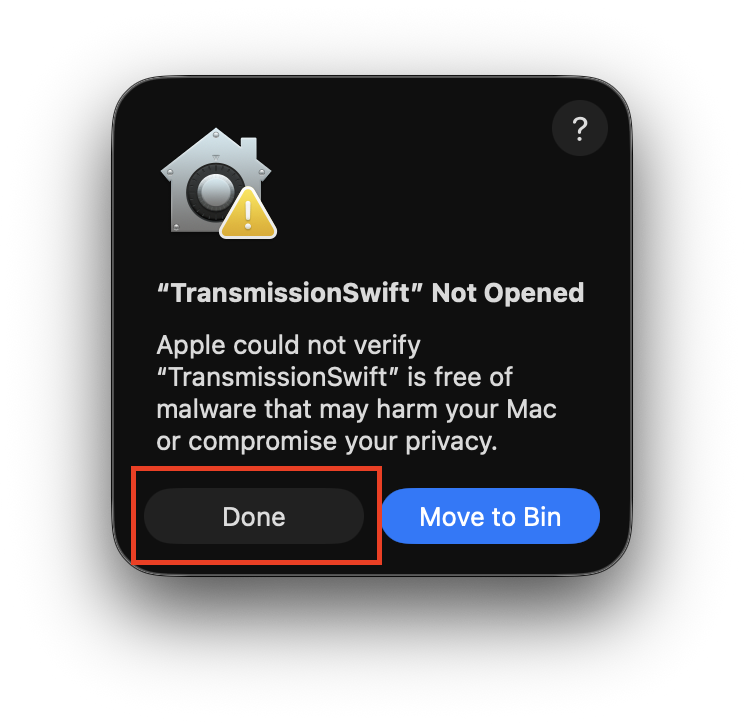
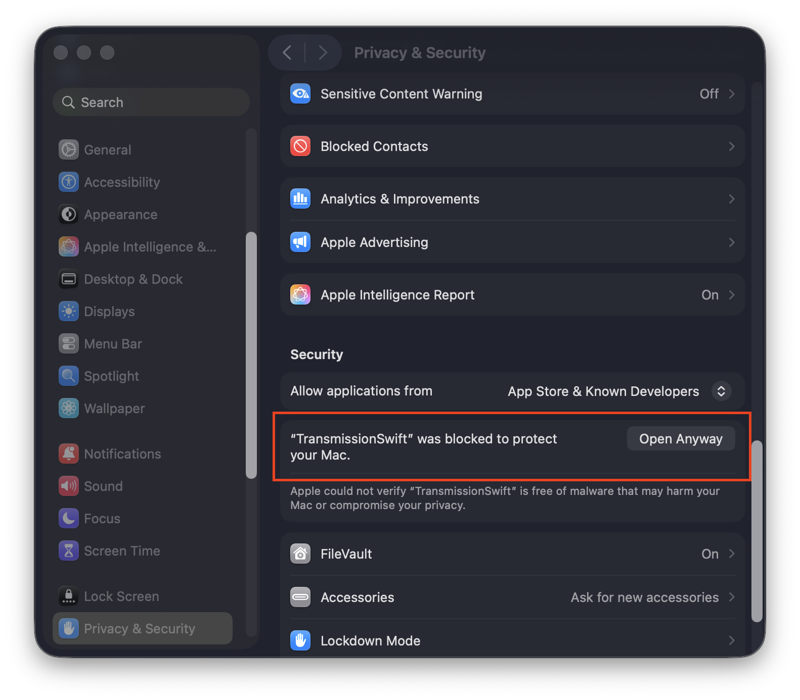

# TransmissionSwift

<!---->

## What is it

This app lets you connect to a remote Transmission instance over RPC.

- Manage active torrents
  - Start/pause
  - Delete, with or without data
  - Verify
  - Update tracker
  - Set priority, set files as unwanted
  - Change download location
- Add new torrents
  - via .torrent files (drag+drop, or register handler for .torrent files)
  - magnets links via UI
- Change server settings
  - Enable slow mode
  - Netowrking config
  - Seeding config
- Combining filters in the sidebar
- Managing torrent labels and assigning colour coding to them
- Path mapping via custom URI patterns, open your files with whatever app you want
  - A few ready presets to open in Cyberduck, reveal in Finder (mounted or not), Open in default app, View in Swizzin web
- App self-updating via Sparkle

It is written in Swift and SwiftUI, zipping down to a ~4MB app with minimal resource use.

## How to open it it

1. [Download latest unsigned release](https://github.com/jvacek/TransmissionSwift/releases)
1. Find in your downloads, and unzip
1. Try to open the unsigned app (it will fail). **Do not move to trash**, just select "Done"
    

    
Screenshot

    
    

1. Follow [instructions here](https://support.apple.com/en-gb/guide/mac-help/mh40616/mac) to bypass the verification (duplicated below for the lazy)
    

    
Screenshot + Instructions

    

    > 1. On your Mac, choose Apple menu > System Settings, then click Privacy & Security in the sidebar. (You may need to scroll down.)
    > 2. Go to Security, then click Open.
    > 3. Click Open Anyway.
    >    This button is available for about an hour after you try to open the app.
    > 4. Enter your login password, then click OK.
    

1. Open again

Alternatively, you can open the project in Xcode and build it from there.

## What doesn't work yet

- Changing server settings from the settings page

## What's being planned

1. Separate polling loop for active torrents
1. iCloud Sync for settings
1. iPhone Version

## Contributing

I will prioritise reviewing any contributions that help overall stability,
performance, and the above mentioned plans.

Please familiarise yourself with the [architecture](ARCHITECTURE.md) and then
feel free todo your thing.
